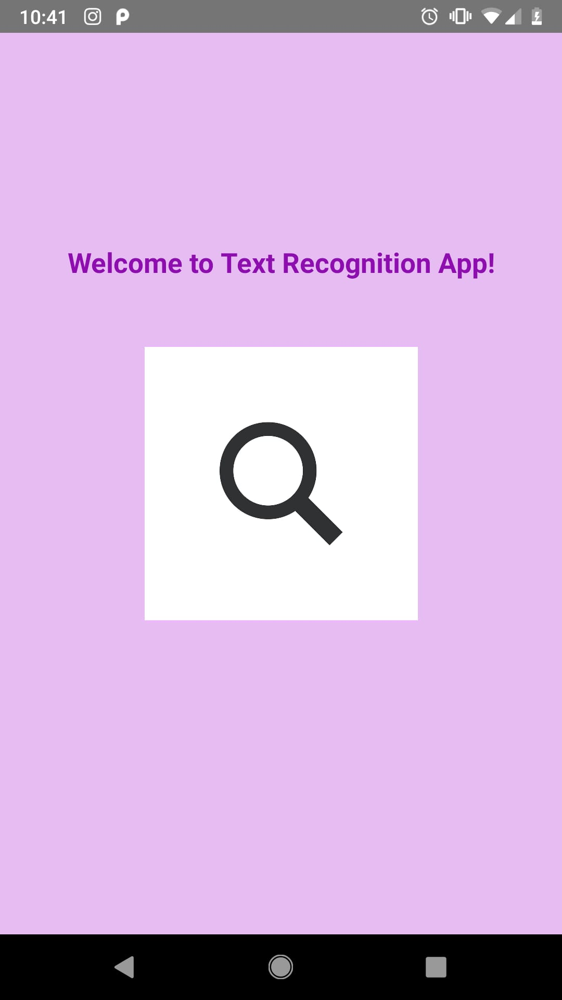

# Assignment 2 -CMPE 277 Smartphone - Cloud Connected App
## App Name : TextReco
### Prof. Kaikai Liu
Submission for - Manjiri Kadam

* Topic9 iOS/Android App: interact with Cloud AI services for any of the following features: speech recognition, image segmentation, object detection, gesture/keypoint recognition, recommendation, or natural language processing (chatbot). 
You need to have the user interface to send your data and display the results. You need to show multiple testing cases for your selected Cloud AI services.

####

### Technologies used :
* Android Studio as IDE
* Kotlin Language for programming
* Text recognition library by Google Cloud - Firebase ML API's (ML kit for Cloud- Cloud Vision API)

### Features:
* Clicking Image
* After taking image, my app will detect the text by clicking "Detect button"
* Output will be shown on text view. 

### Working :
* With ML kit one can recognize the text from the image, with the cloud based API's we can extract text from image of document. There are two type of Firebase ML kit available 1) On-device 2) Cloud. I chose to use Cloud API.
* This ML kit is the core of my application, here with the help of the camera and internet, can use prediction models by Google to extract the text.

### Resources:

https://firebase.google.com/docs/ml/android/recognize-text
https://firebase.google.com/docs/reference/android/com/google/firebase/ml/vision/text/FirebaseVisionTextRecognizer
https://console.firebase.google.com/u/0/project/recono-e2425/ml/apis

### UI:
App contains two pages (for Assignment 2). One is splash page, which has a logo and welcome screen. Second is main activity, where we have two button, one to take picture other one to detect the text. Output will be shown on text box.

#### 1) Splash Page

#### 2) Main Activity

  
  
  

### Video Link for Assignment 2 

### Application is work in progress. Developing it for Final project.

# FInal Project :

